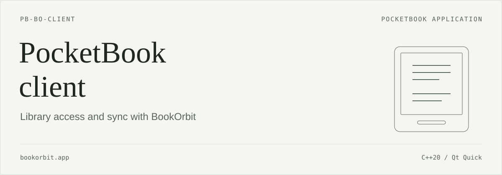

<p align="center"><strong>English</strong> · <a href="readme_RU.md">Русский</a></p>

<p align="center"> </p>

An app for PocketBook 634. Connect to your BookOrbit server, download books and open them in the built-in reader. EPUB reading positions can be sent to the server or retrieved manually.

[Features](#features) · [Screenshots](#screenshots) · [Installation](#install) · [Getting started](#start) · [Position sync](#sync) · [Building](#development)

> **In development.** Target firmware: U634.6.10.3425. Main workflows have been tested in pbemu. The current sources have not completed acceptance testing on a physical PB634; compatibility with other models and firmware versions is unconfirmed.

<a id="screenshots"></a>
## Interface

<table>
<tr><th>Catalog</th><th>Book details</th><th>Position selection</th></tr>
<tr>
<td><a href="assets/readme/catalog.png"></a></td>
<td><a href="assets/readme/details.png"></a></td>
<td><a href="assets/readme/sync.png"></a></td>
</tr>
</table>

Captured in pbemu with firmware U634.6.10.3425, using test books and the Russian interface. The app also has a full English interface, selectable in Settings.

<a id="features"></a>
## Features

- **Library.** Catalog with covers, title/author/series search and pagination. Search collections and open their books.
- **Book details.** Description, edition information, reading status, rating, personal note and collections, when supplied by the server. These details are read-only for now.
- **Downloads.** Choose a file, format and folder; cancel, retry and check SHA-256 integrity. Keep several formats of the same book. Maximum file size: 100 MiB.
- **Offline reading.** The Downloads tab works without signing in. Book metadata and covers are cached on the device. EPUB, FB2, PDF, TXT and DJVU open in the built-in reader. Other formats can be downloaded, but cannot be opened from the client yet.
- **Reading position.** Manually exchange EPUB progress with the server for one book or all downloaded EPUBs belonging to the current connection. Conflicts require an explicit choice.
- **Connections and settings.** Multiple saved servers, HTTPS sign-in, session renewal and sign-out. Switch between English and Russian without restarting. Enable the operation log in Settings.

<a id="install"></a>
## Installation

Before trying a new build, back up the previous `bookorbit.app`, the client data directory, your books and their native reading data. Start with a separate test account and EPUB. Emulator checks do not replace testing on a physical device after USB disconnection and reboot.

Copy `bookorbit.app` into **`applications/`** in the reader's internal storage, safely eject it, and launch the app from the PocketBook application list. The device path is `/mnt/ext1/applications/bookorbit.app`.

To roll back, close the app and restore the previous executable and, if necessary, its matching data backup. Replacing the executable alone does not undo position sync already performed.

<a id="start"></a>
## Getting started

1. Open the app and go to **Settings**. Under **Saved connections**, tap **Add**.
2. Enter the server address, such as `https://books.example.org`, your username and password. Tap **Sign in**. Use the server's base address without `/api/v1`.
3. If needed, go to **Book download folder** → **Choose folder…**. This setting affects new downloads; existing books stay where they are.
4. Open **Catalog** or **Collections**, choose a book and format, then tap **Download …**.
5. Once downloaded, tap **Read …**. If the file is still being registered in the built-in library, wait and try again. You can also open the downloaded book from the PocketBook library.

Browsing the catalog and collections, downloading, and syncing positions require a network connection and server sign-in. The app invokes the built-in PocketBook network connection flow when needed. Use **Downloads** for books already on the device.

In **Settings** → **Interface language**, choose **English**, **Русский** or **Follow system**. Your choice is stored on the device and applies to all saved connections. Book titles, descriptions and other server content retain their original language.

<a id="sync"></a>
## Position sync

Close books in the built-in reader, return to the app and open **Sync**, then tap **Sync now**. To sync a single EPUB, use **Compare positions** in its details. **The Home button does not close a book.** After receiving a position, open the book as usual.

When positions conflict, choose **Use reader position** or **Use BookOrbit position**. After syncing multiple books, review their results in the sync view. Open a conflicting book to compare and choose its position.

Limitations:

- Position sync supports EPUB only. It uses **EPUB CFI** coordinates; percentages are approximate. Neither percentages nor device timestamps decide which position wins a conflict.
- Regular sync checks the local SHA-256 and exchanges progress without downloading the EPUB again. **Verify library files** in Settings separately downloads and compares all downloaded formats for the current account, sequentially and with cancellation support. It does not replace books or sync progress. A detected mismatch is saved and blocks position sync while keeping local reading available. A matching verification or an explicit **Download again** clears the block. Until verification runs, the app assumes the server has not replaced content under the same file ID.
- Incoming positions use the built-in library's internal API, only on U634.6.10.3425 with a verified `libframework2.so` hash and closed books. Other firmware/library versions block position application.
- If server progress includes a page number or other coordinates the client cannot preserve, uploading a position is blocked.
- The BookOrbit API used here does not support conditional progress writes. Re-reading before upload reduces, but does not eliminate, concurrent-update races.
- **There is no background sync.** Opening a book from the library, leaving the reader, sleep and wake do not initiate sync. Use the app's sync controls.

<a id="development"></a>
## Building and maintenance

The client is written in C++20 and Qt Quick/QML. On the reader, it uses Qt 6.8.2 and InkView from the firmware. The interface, icons and translations are embedded in `bookorbit.app`.

<details>
<summary>Building for PocketBook</summary>

You need Git and Docker or Podman. The compiler, CMake, Qt and cross-compilation libraries are supplied by the container. The SDK and image below are pinned to the versions used in the working build procedure. The image supports Linux amd64/arm64; on macOS and Windows it runs inside a Linux VM.

From the cloned client repository containing `CMakeLists.txt`, get [pocketbook-sdk-qt6](https://github.com/fstanis/pocketbook-sdk-qt6) in a sibling folder:

```bash
git clone https://github.com/fstanis/pocketbook-sdk-qt6.git ../pocketbook-sdk-qt6
git -C ../pocketbook-sdk-qt6 checkout 754e436c7c24b4e2695154e2efffbf7447b4130e
git -C ../pocketbook-sdk-qt6 submodule update --init --depth 1
```

The SDK includes a large PocketBook submodule. Allow several gigabytes for it and the container image. If you already have the SDK, use the existing checkout at the pinned commit with its submodule initialized.

From the client repository root:

```bash
BO_SOURCE="$PWD"
BO_SDK="$(cd ../pocketbook-sdk-qt6 && pwd)"
BO_IMAGE="ghcr.io/fstanis/pocketbook-sdk-qt6-builder@sha256:4028eba9874caf760592e9d3e81b8f396ef78413c74758a4608fa0a4a8eff62a"

docker run --rm \
  -v "$BO_SOURCE:/src" \
  -v "$BO_SDK:/sdk:ro" \
  -w /src "$BO_IMAGE" bash -lc \
  'cmake -S . -B build/pocketbook \
    -DPOCKETBOOK_QT_SDK=/sdk \
    -DCMAKE_BUILD_TYPE=Release \
    -DBOOKORBIT_CHECKS=OFF && \
   cmake --build build/pocketbook -j2'
```

For Podman, replace `docker run --rm` with `podman run --rm --userns=keep-id`. The image sets `CMAKE_TOOLCHAIN_FILE`; you do not need to install the old PocketBook compiler separately.

Output: **`build/pocketbook/bookorbit.app`**, ARMv7 with softfp ABI. Qt and system libraries are supplied by the reader firmware and are not bundled into the executable.

The versioned `tools/` folder contains development and test tools. Ordinary builds do not need these tools. `BOOKORBIT_CHECKS` defaults to `OFF`; enable it to build integration checks.

</details>

<details>
<summary>Building for desktop</summary>

The desktop build supports the interface and server API. Integration with the built-in library and PocketBook position sync require a device build.

Dependencies: **CMake 3.21+**, a C++20 compiler, **Qt 6.5+** with Core, Gui, Qml, Quick, Network and Xml, the QtQuick.Controls and QtQuick.Layouts QML modules, and zlib. On Ubuntu/Debian with a suitable Qt version:

```bash
sudo apt-get install build-essential cmake qt6-base-dev qt6-declarative-dev \
  qml6-module-qtquick qml6-module-qtquick-controls qml6-module-qtquick-layouts \
  qml6-module-qtquick-templates qml6-module-qtquick-window \
  qml6-module-qtqml-workerscript qt6-svg-plugins zlib1g-dev

cmake -S . -B build/desktop -DCMAKE_BUILD_TYPE=Release -DBOOKORBIT_CHECKS=OFF
cmake --build build/desktop -j2
./build/desktop/bookorbit --server https://books.example.org
```

You can also change the server address in the interface. If Qt is outside the standard search paths, pass `-DCMAKE_PREFIX_PATH=/path/to/Qt` to CMake. Use separate build directories for desktop and PocketBook.

</details>

<details>
<summary>App data and diagnostics</summary>

Client data is stored in `/mnt/ext1/applications/bookorbit/`:

| Relative path | Contents |
|---|---|
| `accounts.json` | Saved server addresses and usernames |
| `preferences.json` | Interface language, download folder, book order and diagnostic setting |
| Connection directories | Download metadata, position sync state, covers and session |
| `diagnostic.log` | Operation log, when enabled |
| `certificates/<server-hostname>.pem` | Additional trusted CA for the named server |

The app creates its data directory on first launch. Books are saved to your chosen folder, defaulting to `/mnt/ext1/Books` if it exists, otherwise `/mnt/ext1/books`. The download folder must be on the same filesystem as the client data. Desktop data uses `QStandardPaths::AppLocalDataLocation` for the application name `bookorbit`.

**Passwords are not saved.** To restore sign-in, the app saves a refresh token only when restrictive file permissions can be confirmed. Filesystems that cannot confirm this protection require signing in again after restart. Signing out removes the local session and keeps downloaded books.

Enable diagnostics in Settings to write the operation log to `diagnostic.log`.

</details>

<details>
<summary>Server and HTTPS</summary>

The client uses the BookOrbit `/api/v1` API with `clientKind: native` sign-in. It needs a compatible server providing the catalog, collections, file downloads and EPUB progress. Catalog access and sign-in were tested with BookOrbit 3.0.0; compatibility with all later versions is not guaranteed.

Normal builds accept HTTPS only and verify server certificates. For a private certificate authority, place its public PEM certificate in `certificates/<server-hostname>.pem` inside the client data directory, for example `certificates/books.example.org.pem`. Do not put the private key there.

The sources retain the default address `https://books.lan` and a public CA from the local test environment in `resources/books-lan-ca.pem`. That CA is added only for the hostname `books.lan`. Enter your own server address in Settings.

</details>

<details>
<summary>Source layout</summary>

| Path | Purpose |
|---|---|
| `src/main.cpp` | Application and Qt/QML startup |
| `src/client.*` | BookOrbit API, connections, catalog, downloads and progress exchange |
| `src/device.*` | InkView, built-in reader, system language and native position application |
| `src/progress.*` | EPUB CFI validation and approximate reading percentage |
| `src/i18n.h` | Language selection and translation of saved messages |
| `qml/` | Interface, icons and QML resources |
| `translations/` | Qt Linguist catalogs (`.ts`) and embedded translations (`.qm`) |
| `resources/` | Other application resources |
| `CMakeLists.txt` | Desktop and PocketBook builds |

</details>

<details>
<summary>Automated checks</summary>

GitHub Actions builds the desktop app in Debian trixie with Qt 6 and runs CTest. Checks use temporary data, synthetic EPUBs and an HTTP server on a random local port. No credentials or live BookOrbit server are required.

```bash
cmake -S . -B build/desktop -DCMAKE_BUILD_TYPE=Debug -DBOOKORBIT_CHECKS=ON
cmake --build build/desktop -j2
ctest --test-dir build/desktop --output-on-failure
```

The full `client_integration` check emulates the PocketBook storage layout and needs writable `/mnt/ext1/books` and `/mnt/ext1/applications`. Run it in a disposable Linux container, as in `.github/workflows/desktop.yml`, never on mounted storage from a real reader. Other checks use temporary directories:

```bash
ctest --test-dir build/desktop -R 'audit_regressions|mock_contract|language_ui|translation_catalogs' --output-on-failure
```

`tools/run_desktop_checks.py` starts the test server and passes `BOOKORBIT_TEST_ENDPOINT` to the check executable. Production builds do not use this variable. Desktop CTest does not establish device compatibility or validate the private firmware ABI.

### Changes after the audit

- After an HTTP 401 during progress upload, the session is restored, but the original POST is not repeated. The next manual sync checks both positions and the profile again. The `outgoing` journal is retained until the result is confirmed.
- Downloading an existing file again first retrieves its current metadata. Before replacing the old copy, the new EPUB is checked for container, OPF, spine and local resource validity. This is a limited structural check, not EPUBCheck.
- A simple DOCTYPE without external identifiers or an internal subset is accepted. Comments and CDATA are treated as logical CFI text fragments; equivalent validated coordinates do not cause false conflicts.
- Checking a specific coordinate does not require parsing the other chapters. If the API or native setter requires a percentage and it cannot be estimated, the write is blocked with an explanation. A zero percentage is not substituted.
- Messages from quick actions stay on the original screen; cover URLs are refreshed separately. The automatic three-way comparison decision is implemented in `sync_decision.h`.

Remaining work includes moving heavy file operations to a worker, using targeted QAbstractListModel updates instead of the general `changed` signal, further separating Client responsibilities, conditional server progress writes and physical PB634 acceptance testing. Firmware, native library hash and closed-reader restrictions still apply.

</details>

<details>
<summary>Adding a translation</summary>

English is the source language. QML uses `qsTranslate("BookOrbit", ...)`; C++ uses `QCoreApplication::translate("BookOrbit", ...)`. The Russian catalog is `translations/bookorbit_ru.ts`. The `Legacy` context in `bookorbit_en.ts` translates messages saved by older Russian-only versions; do not update that catalog with `lupdate`.

Use Qt Linguist to edit the Russian translation. After changing source text, update and compile the catalogs with the Qt 6 tools (`qt6-l10n-tools` on Debian):

```bash
/usr/lib/qt6/bin/lupdate src qml -ts translations/bookorbit_ru.ts
/usr/lib/qt6/bin/lrelease translations/bookorbit_ru.ts translations/bookorbit_en.ts
python3 tools/check_translations.py
```

Commit both `.ts` and `.qm` files; normal application builds do not require Linguist. To add another language, create `translations/bookorbit_<code>.ts`, translate every message in the `BookOrbit` context, compile it to `.qm`, and add it to `qml/app.qrc`. Register its code and native name in `interfaceLanguages()` in `src/i18n.h`; Settings and system-language selection use that registry automatically. Extend the language and catalog coverage checks. Unsupported system languages use English.

</details>
