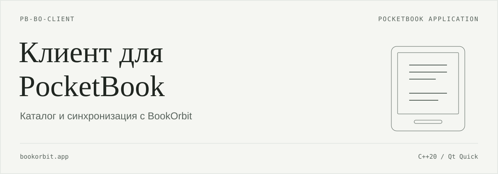
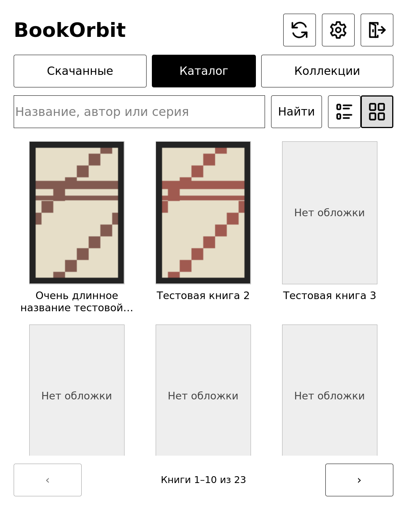
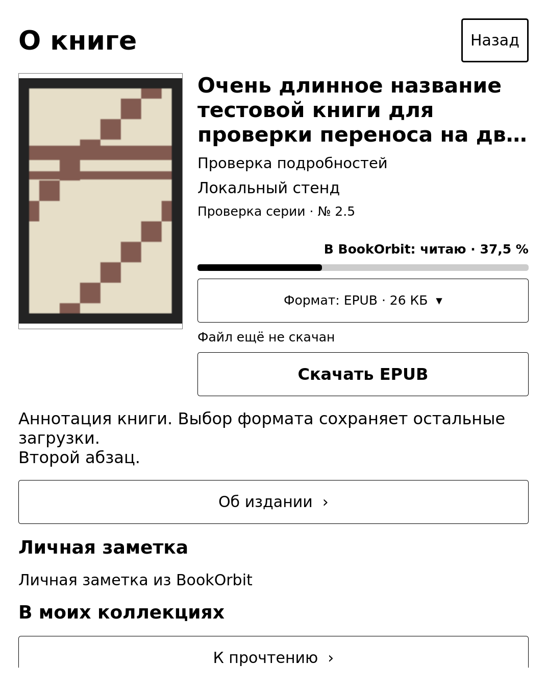
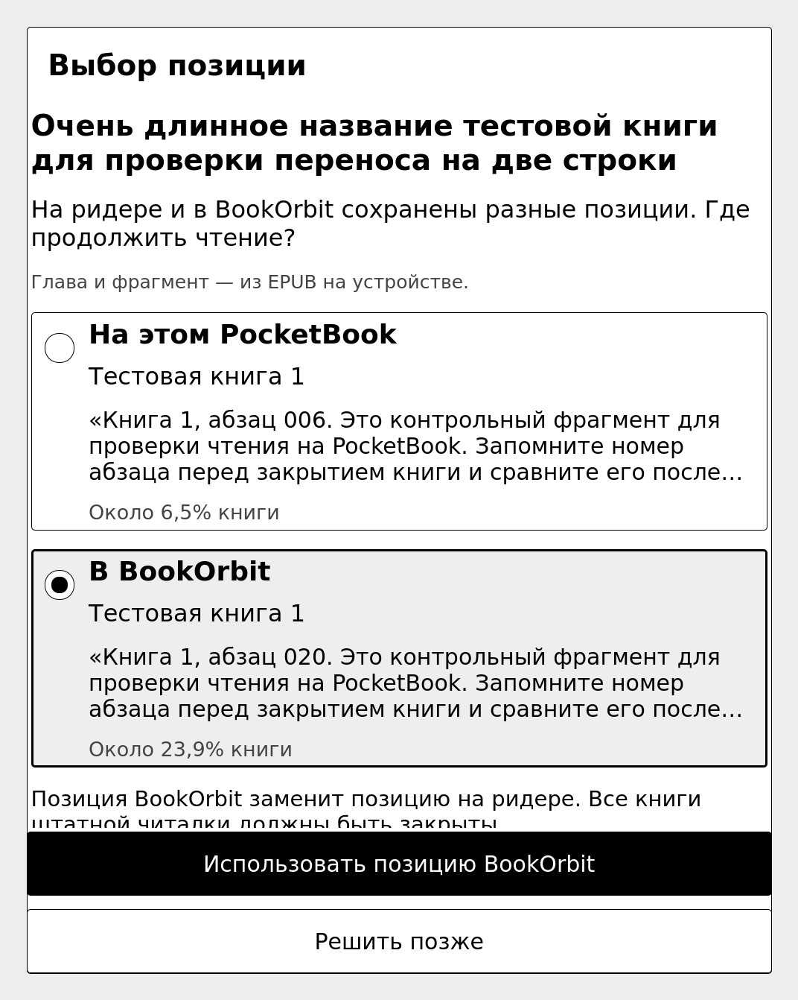

<p align="center"><a href="readme.md">English</a> · <strong>Русский</strong></p>

<p align="center"> </p>

Приложение для PocketBook 634. Подключается к серверу BookOrbit, скачивает книги и открывает их в штатной читалке. Позицию чтения EPUB можно отправить на сервер или получить с него вручную.

[Возможности](#features) · [Скриншоты](#screenshots) · [Установка](#install) · [Начало работы](#start) · [Синхронизация](#sync) · [Сборка](#development)

> **В разработке.** Целевая прошивка: U634.6.10.3425. Основные сценарии проверялись в pbemu. Текущие исходники ещё не прошли приёмку на физическом PB634; совместимость с другими моделями и прошивками не подтверждена.

<a id="screenshots"></a>
## Интерфейс

<table>
<tr><th>Каталог</th><th>Карточка книги</th><th>Выбор позиции</th></tr>
<tr>
<td><a href="assets/readme/catalog.png"></a></td>
<td><a href="assets/readme/details.png"></a></td>
<td><a href="assets/readme/sync.png"></a></td>
</tr>
</table>

Снимки из pbemu с прошивкой U634.6.10.3425. На экранах тестовые книги, русский интерфейс.

<a id="features"></a>
## Возможности

- **Библиотека.** Каталог с обложками, поиск по названию, автору и серии, страницы результатов. Коллекции можно искать и открывать, чтобы посмотреть их книги.
- **Сведения о книге.** Аннотация, издание, статус чтения, оценка, заметка и коллекции, если сервер их передаёт. Пока эти сведения можно только просматривать.
- **Скачивание.** Выбор файла, формата и папки; отмена, повтор и проверка SHA-256. Можно хранить несколько форматов одной книги. Размер одного файла ограничен 100 МиБ.
- **Чтение без сети.** Вкладка «Скачанные» работает без входа. Обложки и сведения о книгах сохраняются на устройстве. EPUB, FB2, PDF, TXT и DJVU открываются в штатной читалке. Другие форматы можно скачать, но открыть из клиента пока нельзя.
- **Позиция чтения.** Ручной обмен позицией EPUB с сервером, для одной книги или всех скачанных EPUB текущего подключения. При конфликте позицию выбирает пользователь.
- **Подключения и настройки.** Несколько серверов, вход по HTTPS, обновление сессии и выход. Русский и английский интерфейс переключаются без перезапуска. Журнал операций включается в настройках.

<a id="install"></a>
## Установка

Перед испытанием новой сборки сохраните предыдущий `bookorbit.app`, папку данных клиента и резервную копию книг со штатными данными чтения. Начинайте с отдельной учётной записи и тестового EPUB. Проверка в эмуляторе не заменяет проверку на устройстве после отключения USB и перезагрузки.

Скопируйте `bookorbit.app` в папку **`applications/`** внутренней памяти ридера, безопасно извлеките устройство и запустите приложение из списка приложений PocketBook. Полный путь на ридере: `/mnt/ext1/applications/bookorbit.app`.

Для отката закройте приложение и восстановите сохранённый бинарный файл; при необходимости восстановите соответствующую резервную копию данных. Замена бинарного файла сама по себе не отменяет уже выполненную синхронизацию позиции.


<a id="start"></a>
## Начало работы

1. Откройте приложение и перейдите в «Настройки». В разделе «Сохранённые подключения» нажмите «Добавить».
2. Введите адрес сервера, например `https://books.example.org`, имя пользователя и пароль. Нажмите «Войти». Указывайте базовый адрес сервера без `/api/v1`.
3. При необходимости выберите «Папка для скачивания книг» → «Выбрать папку…». Настройка применяется к новым загрузкам; ранее скачанные книги остаются на своих местах.
4. Откройте «Каталог» или «Коллекции», выберите книгу и нужный формат, затем нажмите «Скачать …».
5. После загрузки нажмите «Читать …». Если файл ещё регистрируется в штатной библиотеке, подождите и повторите открытие. Скачанную книгу также можно открыть из библиотеки PocketBook.

Для каталога, коллекций, загрузки и обмена позицией нужны сеть и вход на сервер. Клиент вызывает штатное подключение PocketBook к сети при необходимости. Для уже скачанных книг используйте вкладку «Скачанные».

В «Настройках» выберите язык: «Русский», «English» или «Как в системе». Без ручного выбора русская система получает русский интерфейс, остальные языки системы используют английский. Настройка действует для всех подключений. Названия книг, аннотации и другие сведения с сервера остаются на исходном языке.


<a id="sync"></a>
## Синхронизация позиции

Закройте книги в штатной читалке, вернитесь в клиент и откройте **«Синхронизация»** → **«Синхронизировать»** для общей сверки либо нажмите **«Сверить позиции»** в карточке EPUB. **Кнопка Home сама по себе не закрывает книгу.** После получения позиции откройте книгу обычным способом.

При конфликте клиент предлагает «Использовать позицию ридера» или «Использовать позицию BookOrbit». После общей сверки результаты доступны на карточках книг; конфликтную книгу нужно сверить отдельно и выбрать позицию.

Ограничения:

- Обмен позицией реализован только для EPUB. Используется координата **EPUB CFI**, а процент показывает приблизительное место в книге. Клиент не выбирает позицию по проценту или часам устройства.
- Синхронизация проверяет локальный SHA-256 и обменивается прогрессом без повторного скачивания EPUB. Серверное содержимое сверяет отдельная команда «Полная проверка библиотеки» в настройках: все скачанные форматы текущего аккаунта, последовательно и с отменой, без замены книг и обмена прогрессом. Обнаруженное расхождение сохраняется в записи файла и блокирует обмен позицией, сохраняя локальное чтение. Проверка совпадения или явное «Скачать заново» снимает блокировку. До полной проверки клиент не обнаружит, что сервер заменил содержимое под прежним fileId.
- Входящая позиция применяется через внутренний API штатной библиотеки только на U634.6.10.3425 с проверенным хешем `libframework2.so` и при закрытых книгах. При несовпадении прошивки или библиотеки применение блокируется.
- Если сервер хранит номер страницы или другие координаты, которые клиент не умеет сохранить при отправке, исходящая запись блокируется.
- Используемый API BookOrbit не поддерживает условную запись прогресса. Повторное чтение перед отправкой уменьшает риск, но не исключает одновременное обновление с другого устройства.
- **Фоновой синхронизации нет.** Открытие книги из библиотеки, выход из читалки, сон и пробуждение сами по себе не запускают обмен. Изменения сверяются по кнопке в клиенте.


<a id="development"></a>
## Сборка и обслуживание

Клиент написан на C++20 и Qt Quick/QML. На ридере используются Qt 6.8.2 и InkView из прошивки. Интерфейс, иконки и переводы встроены в `bookorbit.app`.

<details>
<summary>Сборка для PocketBook</summary>

Нужны Git и Docker либо Podman. Компилятор, CMake, Qt и библиотеки для кросс-компиляции находятся в контейнере. Ниже закреплены SDK и образ, использованные в рабочем сценарии сборки. Образ предназначен для Linux amd64/arm64; на macOS и Windows контейнер выполняется в Linux VM.

Откройте корень клонированного репозитория клиента, где находится `CMakeLists.txt`. Получите [pocketbook-sdk-qt6](https://github.com/fstanis/pocketbook-sdk-qt6) в соседнюю папку:

```bash
git clone https://github.com/fstanis/pocketbook-sdk-qt6.git ../pocketbook-sdk-qt6
git -C ../pocketbook-sdk-qt6 checkout 754e436c7c24b4e2695154e2efffbf7447b4130e
git -C ../pocketbook-sdk-qt6 submodule update --init --depth 1
```

SDK включает крупный подмодуль PocketBook; для загрузки и контейнера потребуется несколько гигабайт свободного места. Если SDK уже скачан, используйте существующую копию на указанном коммите с инициализированным подмодулем.

Из корня репозитория клиента:

```bash
BO_SOURCE="$PWD"
BO_SDK="$(cd ../pocketbook-sdk-qt6 && pwd)"
BO_IMAGE="ghcr.io/fstanis/pocketbook-sdk-qt6-builder@sha256:4028eba9874caf760592e9d3e81b8f396ef78413c74758a4608fa0a4a8eff62a"

docker run --rm \
  -v "$BO_SOURCE:/src" \
  -v "$BO_SDK:/sdk:ro" \
  -w /src "$BO_IMAGE" bash -lc \
  'cmake -S . -B build/pocketbook \
    -DPOCKETBOOK_QT_SDK=/sdk \
    -DCMAKE_BUILD_TYPE=Release \
    -DBOOKORBIT_CHECKS=OFF && \
   cmake --build build/pocketbook -j2'
```

Для Podman замените `docker run --rm` на `podman run --rm --userns=keep-id`. Образ сам задаёт `CMAKE_TOOLCHAIN_FILE`; отдельная установка старого компилятора PocketBook не требуется.

Готовый файл: **`build/pocketbook/bookorbit.app`**, ARMv7 с ABI softfp. Qt и системные библиотеки в файл не включаются: приложение использует библиотеки прошивки ридера.

В папке `tools/` хранятся инструменты разработки и проверок. Она не нужна для обычной сборки. Опция `BOOKORBIT_CHECKS` по умолчанию выключена; при включении собираются интеграционные проверки.

</details>

<details>
<summary>Сборка для компьютера</summary>

Настольная сборка позволяет работать с интерфейсом и API сервера. Интеграция со штатной библиотекой и синхронизация позиции PocketBook доступны только в сборке для устройства.

Зависимости: **CMake 3.21+**, компилятор C++20, **Qt 6.5+** с Core, Gui, Qml, Quick, Network, Xml, модулями QML QtQuick.Controls и QtQuick.Layouts, а также zlib. В Ubuntu/Debian с подходящей версией Qt:

```bash
sudo apt-get install build-essential cmake qt6-base-dev qt6-declarative-dev \
  qml6-module-qtquick qml6-module-qtquick-controls qml6-module-qtquick-layouts \
  qml6-module-qtquick-templates qml6-module-qtquick-window \
  qml6-module-qtqml-workerscript qt6-svg-plugins zlib1g-dev

cmake -S . -B build/desktop -DCMAKE_BUILD_TYPE=Release -DBOOKORBIT_CHECKS=OFF
cmake --build build/desktop -j2
./build/desktop/bookorbit --server https://books.example.org
```

Адрес сервера можно изменить и в интерфейсе. Если Qt установлен вне стандартных путей, передайте CMake параметр `-DCMAKE_PREFIX_PATH=/путь/к/Qt`. Не используйте один каталог сборки для компьютера и PocketBook.

</details>

<details>
<summary>Данные приложения и диагностика</summary>

Данные клиента находятся в `/mnt/ext1/applications/bookorbit/`:

| Путь относительно папки данных | Содержимое |
|---|---|
| `accounts.json` | Сохранённые адреса серверов и имена пользователей |
| `preferences.json` | Язык интерфейса, папка загрузок, порядок книг и настройка диагностики |
| Папки подключений | Метаданные скачанных файлов, состояние обмена позицией, обложки и сессия |
| `diagnostic.log` | Журнал, если включён в настройках |
| `certificates/<имя-сервера>.pem` | Дополнительный доверенный CA для указанного сервера |

При первом запуске приложение создаёт папку данных. Книги сохраняются в выбранную папку. По умолчанию используется `/mnt/ext1/Books`, если она существует, иначе `/mnt/ext1/books`. Папка загрузок должна находиться на той же файловой системе, что и данные клиента. В настольной сборке данные находятся в системном каталоге `QStandardPaths::AppLocalDataLocation` для приложения `bookorbit`.

**Пароль не сохраняется.** Клиент сохраняет токен обновления сессии (refresh token), только если удалось подтвердить, что доступ к файлу есть лишь у его владельца. Если файловая система не позволяет подтвердить защиту, после перезапуска понадобится повторный вход. Выход из аккаунта удаляет локальную сессию, сохраняя скачанные книги.

Журнал операций включается в настройках. Когда диагностика включена, клиент записывает его в `diagnostic.log`.

</details>

<details>
<summary>Сервер и HTTPS</summary>

Клиент использует API BookOrbit `/api/v1` с входом `clientKind: native`. Требуется совместимый сервер с каталогом, коллекциями, скачиванием файлов и прогрессом EPUB. Каталог и вход проверялись с BookOrbit 3.0.0; совместимость со всеми последующими версиями не гарантируется.

Обычная сборка принимает только HTTPS и проверяет сертификат сервера. Для собственного центра сертификации поместите его публичный PEM-сертификат в `certificates/<имя-сервера>.pem` внутри папки данных клиента; например, `certificates/books.example.org.pem`. Приватный ключ туда помещать не нужно.

В исходниках пока сохранены адрес по умолчанию `https://books.lan` и публичный CA локального стенда в `resources/books-lan-ca.pem`. Этот CA добавляется только для имени `books.lan`. При работе со своим сервером укажите его адрес в настройках.

</details>

<details>
<summary>Структура исходников</summary>

| Путь | Назначение |
|---|---|
| `src/main.cpp` | Запуск приложения и Qt/QML |
| `src/client.*` | API BookOrbit, подключения, каталог, загрузки и обмен прогрессом |
| `src/device.*` | InkView, штатная читалка и применение позиции на PocketBook |
| `src/progress.*` | Проверка EPUB CFI и приблизительного процента чтения |
| `src/i18n.h` | Выбор языка и перевод сохранённых сообщений |
| `translations/` | Каталоги Qt Linguist (`.ts`) и встроенные переводы (`.qm`) |
| `qml/` | Интерфейс, иконки и ресурсы QML |
| `resources/` | Дополнительные ресурсы приложения |
| `CMakeLists.txt` | Настольная сборка и кросс-компиляция для PocketBook |

</details>

<details>
<summary>Автоматические проверки</summary>

GitHub Actions собирает настольную версию в Debian trixie с Qt 6 и запускает CTest.
Используются только временные данные, синтетические EPUB и HTTP-сервер на случайном
локальном порту. Пароли и адрес работающего BookOrbit не нужны.

```bash
cmake -S . -B build/desktop -DCMAKE_BUILD_TYPE=Debug -DBOOKORBIT_CHECKS=ON
cmake --build build/desktop -j2
ctest --test-dir build/desktop --output-on-failure
```

Полный `client_integration` проверяет эмуляцию структуры PocketBook и требует
доступного для записи `/mnt/ext1/books` и `/mnt/ext1/applications`. Запускайте его
в одноразовом Linux-контейнере, как в `.github/workflows/desktop.yml`, не на
смонтированной памяти реального ридера. Остальные проверки используют временные каталоги:

```bash
ctest --test-dir build/desktop -R 'audit_regressions|mock_contract|language_ui|translation_catalogs' --output-on-failure
```

`tools/run_desktop_checks.py` сам запускает сервер и задаёт тестовому бинарному
файлу `BOOKORBIT_TEST_ENDPOINT`. Этот параметр не влияет на обычную сборку.
Настольные тесты не подтверждают работу на ридере или совместимость с внутренними библиотеками прошивки.

### Изменения после аудита

* После HTTP 401 при отправке прогресса сессия восстанавливается, но прежний POST
  не повторяется. Следующая ручная сверка заново проверяет обе позиции и профиль.
  Журнал `outgoing` сохраняется до подтверждения результата.
* Повторная загрузка существующего файла сначала получает актуальные метаданные.
  Новый EPUB проходит проверку контейнера, OPF, spine и локальных ресурсов до
  замены старой копии. Это ограниченная структурная проверка, не EPUBCheck.
* Разрешён простой DOCTYPE без внешних идентификаторов и внутреннего subset.
  Комментарии и CDATA учитываются как логические текстовые фрагменты CFI;
  эквивалентные проверенные координаты не вызывают ложного конфликта.
* Проверка конкретной координаты не требует разбора остальных глав. Если API или
  штатный setter требуют процент, невозможность оценить его блокирует запись
  с отдельной причиной; нулевой процент не подставляется.
* Сообщения быстрых действий остаются на исходном экране; URL обложек обновляются
  отдельно. Автоматическое решение трёхсторонней сверки вынесено в `sync_decision.h`.

Остаются отдельными задачами: перенос тяжёлых файловых операций в worker,
точечные QAbstractListModel вместо общего `changed`, дальнейшее разделение Client,
серверная условная запись прогресса и приёмка на физическом PB634. Ограничения
по прошивке, хешу нативной библиотеки и закрытой читалке сохранены.

</details>

<details>
<summary>Добавление перевода</summary>

В исходниках используется английский язык. Тексты QML используют `qsTranslate("BookOrbit", ...)`, в C++ используется `QCoreApplication::translate("BookOrbit", ...)`. Русский каталог находится в `translations/bookorbit_ru.ts`. Файл `bookorbit_en.ts` с контекстом `Legacy` нужен для перевода сообщений, сохранённых прежними русскоязычными версиями; его не обновляют через `lupdate`.

Для изменения русского перевода используйте Qt Linguist. После изменения текстов обновите каталог и скомпилируйте его утилитами Qt 6 (в Debian пакет `qt6-l10n-tools`):

```bash
/usr/lib/qt6/bin/lupdate src qml -ts translations/bookorbit_ru.ts
/usr/lib/qt6/bin/lrelease translations/bookorbit_ru.ts translations/bookorbit_en.ts
python3 tools/check_translations.py
```

Файлы `.ts` и `.qm` хранятся вместе в репозитории; обычная сборка не требует Linguist. Чтобы добавить язык, создайте `translations/bookorbit_<код>.ts`, переведите все сообщения контекста `BookOrbit`, получите `.qm` и добавьте его в `qml/app.qrc`. Зарегистрируйте код и название на языке перевода в `interfaceLanguages()` в `src/i18n.h`; список настроек и выбор по языку системы используют этот реестр автоматически. Добавьте новый язык в проверки интерфейса и полноты каталога. Неподдерживаемые языки системы используют английский.

</details>
